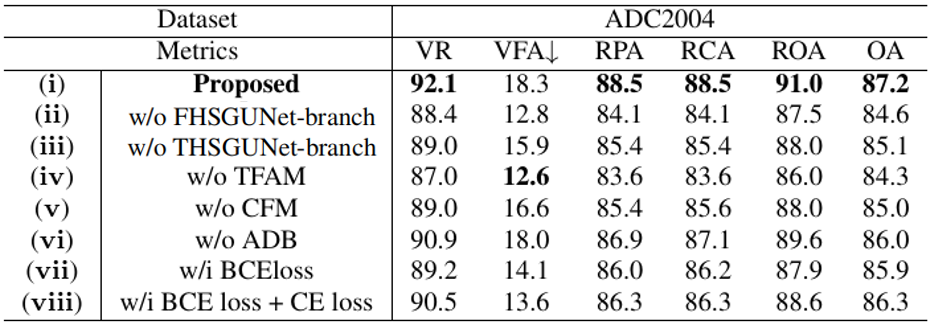
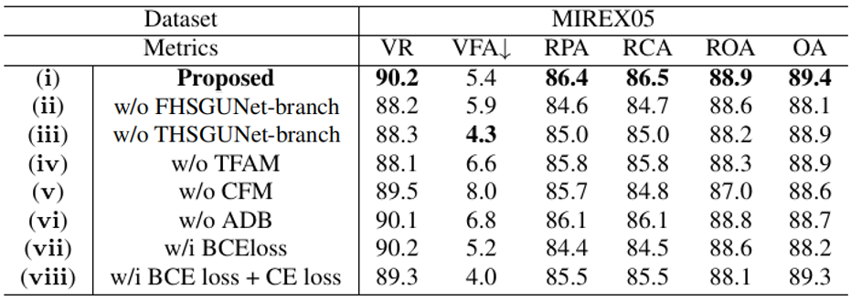

# DANet

## Introduction

The official implementation of "DANET: DIFFERENCE-VALUE ATTENTION NETWORK FOR SINGING MELODY EXTRACTION FROM POLYPHONIC MUSIC". We propose a difference-value attention network (DANet) for melody extraction, which can effectively characterize the fundamental frequency based on emphasizing harmonic contour. Experimental result demonstrates the effectiveness of the proposed network.

## Important updata
### 2023. 09. 04

(i) Update the critical code, and the rest of the code will be released soon.

Uploaded: 

* [model](model/danet.py)
* [add noise](add_noise.py)
* [CFP representation generation](feature_extraction.py)
* [pre-train model](pre-train%20model)

Subsequent update: 

* control group model 

* data generation code 
                   
* complete code with training and testing

## Getting Started

### Download Datasets

* [MIR-1k](https://sites.google.com/site/unvoicedsoundseparation/mir-1k)
* [ADC 2004 & MIREX05](https://labrosa.ee.columbia.edu/projects/melody/)
* [MedleyDB](https://medleydb.weebly.com/)

After downloading the data, use the txt files in the data folder, and process the CFP feature by [feature_extraction.py](feature_extraction.py).

Note that the label data corresponding to the frame shift should be available before generation.

## Model implementation

Refer to the file: [danet.py](model/danet.py)

## Result

### Prediction result

The visualization illustrates that our proposed DANet can reduce the octave errors and the melody detection errors.

### Visualization result

  
  
  
  

&nbsp;&nbsp;&nbsp;&nbsp;&nbsp;&nbsp;&nbsp;&nbsp;&nbsp;&nbsp;&nbsp;&nbsp;&nbsp;&nbsp;&nbsp;&nbsp;&nbsp;&nbsp;&nbsp;&nbsp;&nbsp;&nbsp;&nbsp;&nbsp;&nbsp;&nbsp;&nbsp;(a)&nbsp;&nbsp;&nbsp;&nbsp;&nbsp;&nbsp;&nbsp;&nbsp;&nbsp;&nbsp;&nbsp;&nbsp;&nbsp;&nbsp;&nbsp;&nbsp;&nbsp;&nbsp;&nbsp;&nbsp;&nbsp;&nbsp;&nbsp;&nbsp;&nbsp;&nbsp;&nbsp;(b)&nbsp;(c)&nbsp;(d)
### Comprehensive result

The scores here are either taken from their respective papers or from the result implemented by us. Experimental results show that our proposed DANet achieves promising performance compared with existing state-of-the-art methods.

The models in the above table correspond to paper and codes:

| model | published | paper | code | model | published | paper | code |
|:--:|:--:|:--:|:--:|:--:|:--:|:--:|:--:|
MCDNN|ISMIR2016|[paper](https://www.researchgate.net/profile/Juhan-Nam/publication/305771827_Melody_Extraction_On_Vocal_Segments_Using_Multi-Column_Deep_Neural_Networks/links/57a0a08508ae5f8b25891892/Melody-Extraction-On-Vocal-Segments-Using-Multi-Column-Deep-Neural-Networks.pdf)|[code](https://github.com/LqNoob/MelodyExtraction-MCDNN/blob/master/MelodyExtraction_SCDNN.py)|MSNet|ICASSP2019|[paper](https://ieeexplore.ieee.org/abstract/document/8682389)|[code](https://github.com/bill317996/Melody-extraction-with-melodic-segnet/blob/master/MSnet/model.py)|
FTANet|ICASSP2021|[paper](https://ieeexplore.ieee.org/abstract/document/9413444)|[code](https://github.com/yushuai/FTANet-melodic/tree/main/network)|TONet|ICASSP2022|[paper](https://ieeexplore.ieee.org/abstract/document/9747304)|[code](https://github.com/RetroCirce/TONet/blob/main/model/tonet.py)|
HGNet|ICASSP2022|[paper](https://ieeexplore.ieee.org/abstract/document/9747629)|-|

### Ablation study result

We conducted seven ablations to verify the effectiveness of each design in the proposed network. Due to the page limit, we selected the ADC2004 dataset for ablation study in the paper. More detailed results are presented here.

### about the application of noisy data

* noisy data for the testing → evaluate the noise immunity and generalization of different models.

The results show that the DSM model and our model are robust to noise.

* noisy data for the training → typical data augmentation
* noisy data for the training and testing → evaluate the resistance of our model to noise effects after training in a noisy environment

DANet with noise for train: Only the training set was randomly added with 0-20db of various types of noise.

DANet with noise for train and test: training and testing sets are randomly added with 0-20db of various types of noise.

## Download the pre-trained model

Refer to the contents of the folder: [pre-train model](pre-train%20model).

## Special thanks

* [Knut(Ke) Chen](https://github.com/RetroCirce)

* [Shuai Yu](https://github.com/yushuai)
